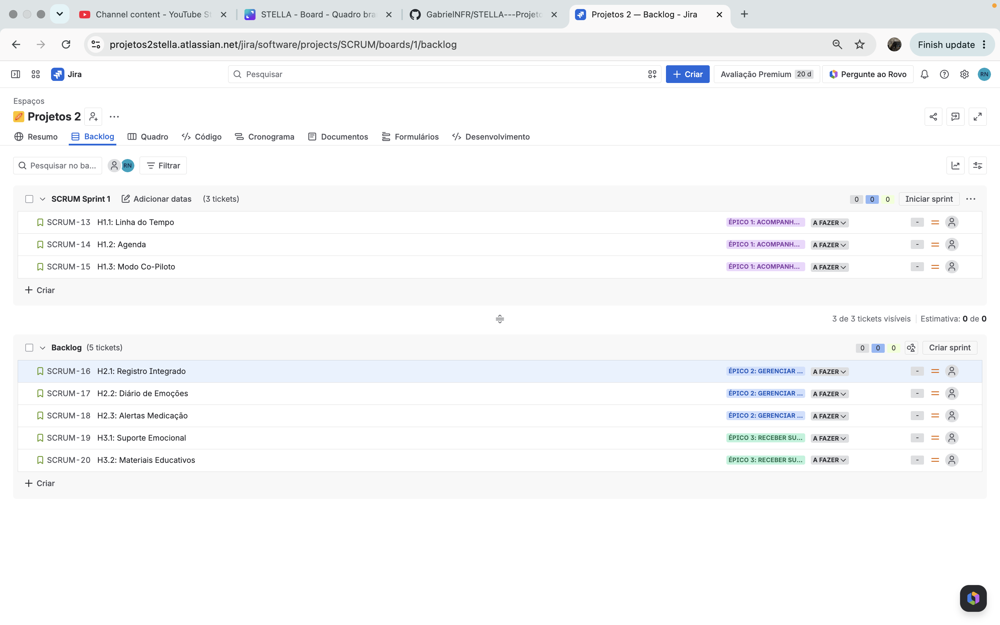
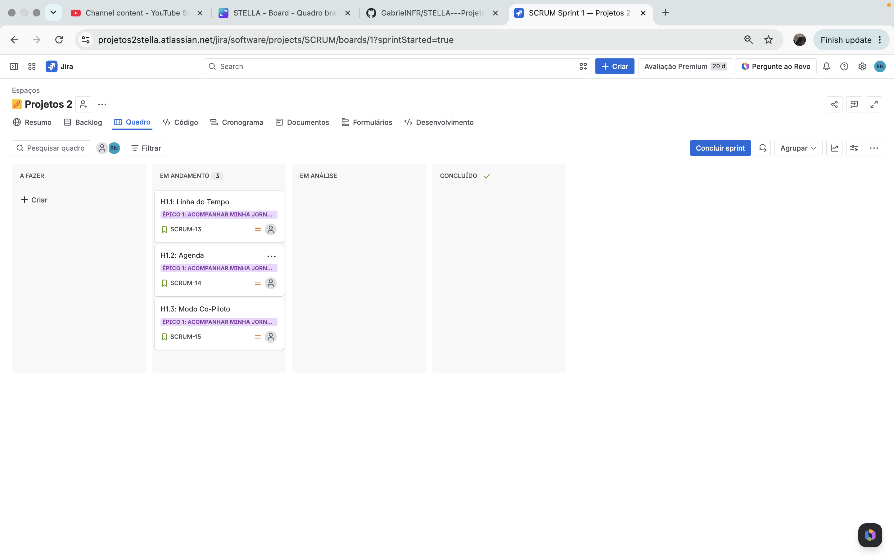

# STELLA | Plataforma de Acompanhamento de Tratamento de FIV

<div align="center">


</div>

Aplicação web para acompanhamento de tratamento de Fertilização In Vitro (FIV), desenvolvida para pacientes da Clínica AMARE. A plataforma centraliza informações, medicações, consultas e documentos, devolvendo à paciente a sensação de controle e segurança durante toda a jornada.

## Equipe — Grupo 10

**Computação**

<table>
  <tr>
    <td align="center"><a href="https://github.com/eliancunha"><b>Elian Cunha</b></a></td>
    <td align="center"><a href="https://github.com/GabrielNFR"><b>Gabriel Rocha</b></a></td>
    <td align="center"><a href="https://github.com/lucasberenguer"><b>Lucas Berenguer</b></a></td>
    <td align="center"><a href="https://github.com/eduardommb"><b>Luiz Braga</b></a></td>
  </tr>
  <tr>
    <td align="center"><a href="https://github.com/MGBcode"><b>Matheus Britto</b></a></td>
    <td align="center"><a href="https://github.com/malucoelho"><b>Maria Luiza Coelho</b></a></td>
    <td align="center"><a href="https://github.com/Rbekah"><b>Rebeca Ferraz</b></a></td>
    <td></td>
  </tr>
</table>

**Design**

<table>
  <tr>
    <td align="center"><a href="https://github.com/gmsc-byte"><b>Graziela Martins</b></a></td>
    <td align="center"><a href="https://github.com/jpcassemiro0"><b>João Cassemiro</b></a></td>
    <td align="center"><a href="https://github.com/EduardaBessa"><b>Maria Eduarda Bessa</b></a></td>
  </tr>
</table>

## Entregas

| Entregável | Sprint 01 | Sprint 02 | Sprint 03 | Sprint 04 |
| --- | --- | --- | --- | --- |
| Histórias de Usuário | H1.1 - H1.3 | H2.1 – H2.3 | H3.1 – H3.2 | [Documento](https://docs.google.com/document/d/1RIJzqYiuKv_tJb9Deknhmri_eNLkZNZRwsHHddazOM4/edit?tab=t.0) |
| Protótipo | [Figma Lo-Fi](https://www.figma.com/design/ZLL48wZw7k46SFmisSLWfX/Stella-Prototype-Lo-Fi?node-id=0-1&p=f&t=CSNVeULHPBKwifRN-0) | [Figma Hi-Fi](https://www.figma.com/proto/b9LYspqu0fCn84TodGghKb/TELAS-AMARE?node-id=439-750&t=Psw5RUycefKHkwAo-1) | — | — |
| Deploy em Produção | — | [Azure](https://lively-pebble-0ccda8e0f.7.azurestaticapps.net) | [Azure](https://lively-pebble-0ccda8e0f.7.azurestaticapps.net) | [Azure](https://lively-pebble-0ccda8e0f.7.azurestaticapps.net) |
| Screencast | [Demo do Sistema](https://youtu.be/0rbMugRNmZw) | [CI/CD](https://www.youtube.com/watch?v=rGUYwvHsWe0&list=PLgYbFnHmKjQ31C2MI-4yfTARr-gZ4x8rM&index=4) | [Testes API](https://www.youtube.com/watch?v=fJgt7q4TpO0&list=PLgYbFnHmKjQ31C2MI-4yfTARr-gZ4x8rM&index=4) | [Testes E2E](https://www.youtube.com/watch?v=g56hNcW6rnY&list=PLgYbFnHmKjQ31C2MI-4yfTARr-gZ4x8rM&index=2) |
| Programação em Par | — | [Relatório](https://docs.google.com/document/d/1cxi1voBc8Khdim200eojCFN_3Y9wsUDTd4Xzk8KK6jU/edit?usp=sharing) | [Relatório](https://docs.google.com/document/d/1cxi1voBc8Khdim200eojCFN_3Y9wsUDTd4Xzk8KK6jU/edit?usp=sharing)  | [Relatório](https://docs.google.com/document/d/1cxi1voBc8Khdim200eojCFN_3Y9wsUDTd4Xzk8KK6jU/edit?usp=sharing)  |
| CI/CD | — | — | — | [GitHub Actions](https://github.com/GabrielNFR/STELLA---Projeto-2/actions) |
| Bug Tracker | [GitHub Issues](https://github.com/GabrielNFR/STELLA---Projeto-2/issues) | ← | ← | ← |

<details>
<summary>Entrega 01 | Histórias de Usuário e Protótipo Lo-Fi</summary>

### Quadro da Sprint e Backlog




</details>

<details>
<summary>Entrega 02 | Implementação e Deploy</summary>

### Histórias Implementadas — Sprint 02

- H1.1: Visualizar linha do tempo do tratamento
- H1.2: Adicionar consulta ou exame na agenda
- H1.3: Modo co-piloto
- H2.1: Registro integrado de medicação e sintomas
- H2.2: Diário de emoções
- H2.3: Alertas de medicação

### Instruções de Acesso ao Deploy

1. Acesse [lively-pebble-0ccda8e0f.7.azurestaticapps.net](https://lively-pebble-0ccda8e0f.7.azurestaticapps.net)
2. Faça login com as credenciais fornecidas pela clínica
3. Navegue pelas funcionalidades pelo menu lateral

</details>

<details>
<summary>Entrega 03 | Novas Histórias e Testes E2E</summary>

### Histórias Implementadas — Sprint 03

- H3.1: Acesso rápido a suporte emocional
- H3.2: Visualização de materiais educativos

### Testes E2E (Selenium)

Os testes automatizados cobrem todas as histórias implementadas, simulando um usuário real no navegador com Selenium + ChromeDriver. São 23 testes no total.

**Como executar:**
```bash
pip install -r e2e/requirements.txt
cd e2e
pytest --verbosity=2
```

</details>

<details>
<summary>Entrega 04 | CI/CD e Entrega Final</summary>

### CI/CD (GitHub Actions)

O pipeline automatiza os testes e o deploy na Azure a cada push na branch main. São 32 testes de API e 23 testes E2E executados automaticamente.

</details>

## Como Contribuir

Veja o [CONTRIBUTING.md](CONTRIBUTING.md) para instruções de configuração, testes e fluxo de trabalho.

## Tecnologias

- **Back-end:** Python 3.13 + Django 6.0 + Django REST Framework
- **Banco de dados:** SQLite (desenvolvimento) / Azure (produção)
- **Front-end:** React 19 + TypeScript + Vite + Tailwind CSS
- **Deploy:** Azure App Service + Azure Static Web Apps
- **Versionamento:** Git + GitHub
- **Testes:** Django APITestCase (32 testes de API) + Selenium (23 testes E2E)
- **CI/CD:** GitHub Actions

## Design

<details>
<summary>Protótipos e Materiais Visuais</summary>

- [Protótipo de Baixa Fidelidade](https://www.figma.com/design/ZLL48wZw7k46SFmisSLWfX/Stella-Prototype-Lo-Fi?node-id=0-1&p=f&t=CSNVeULHPBKwifRN-0) — Figma
- [Moodboard](https://www.canva.com/design/DAHDvoMTJLM/hqSTHFc9RPufExeDf4PjRQ/edit) — Canva
- [Telas de Alta Fidelidade](https://www.figma.com/design/b9LYspqu0fCn84TodGghKb/TELAS-AMARE?node-id=439-750&t=5bpGKpOhOYE0Q8aN-0) — Figma

</details>

## Documentação Adicional

<details>
<summary>Pesquisa e Ideação</summary>

- [Desk Research](https://docs.google.com/document/d/103ANIAQEadMIuUWM5kwDZSC6n_t9JuYM/edit?usp=sharing&ouid=114405899175167523343&rtpof=true&sd=true)
- [Persona Atualizada](https://drive.google.com/file/d/1wgp92xa3uX5PLMOYIk8wnQdO4MMINlj6/view?usp=sharing)
- [User Persona e Mapa de Empatia](https://drive.google.com/file/d/1NdK3WL01cuPxQS-SSHuRN6z5Bv3bWr1/view?usp=sharing)
- [Análise de Similares](https://docs.google.com/spreadsheets/d/1EXk8t48OFYPi4eDS5xwMWSmszn31NcQv/edit?gid=1863085712#gid=1863085712)
- [Brainwriting](https://docs.google.com/document/d/1a0morUqkvJggSA7stWC4wUgFSRDEOz4JvdUXPtAnDRw/edit?tab=t.0#heading=h.o8fytvu8u3nu)
- [Pesquisa de Funcionalidades](https://docs.google.com/document/d/1dPnY5OtfrhOSahmPvxDl5e3fdWpJNLIJ2oGrlhVgidM/edit?usp=sharing)
- [Google Drive — Arquivos do Projeto](https://drive.google.com/drive/folders/1CKaAAoIi-wBSr-T2X3tDdhf3aRNBKza5?usp=sharing)
- [Google Sites — Documentação](https://sites.google.com/cesar.school/stella/home)
- [Slides SR2 — Apresentação](https://canva.link/0qvvnubi1kcihkj)

</details>

<div align="center">

Desenvolvido pelo Grupo 10 | CESAR School — 2026

</div>
